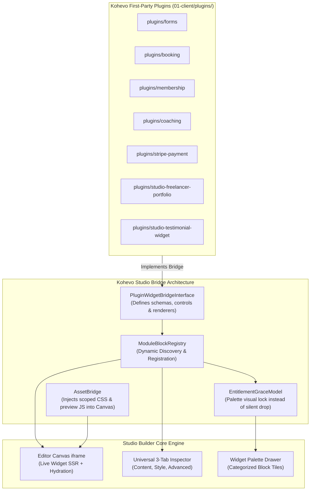
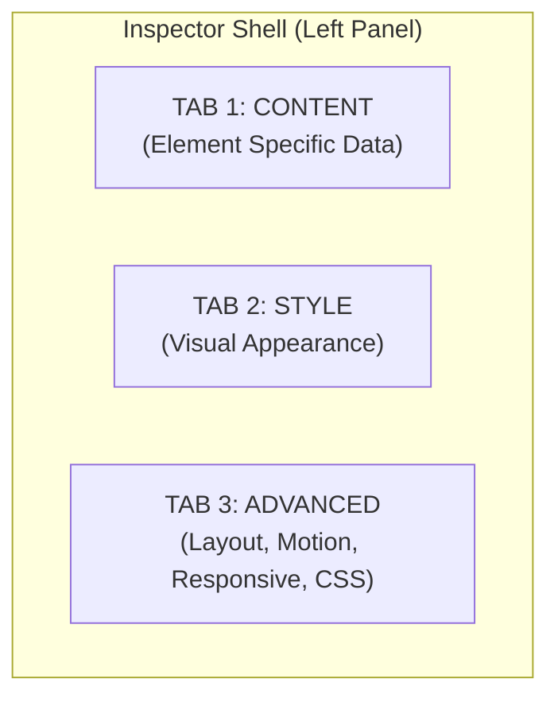

# Kohevo Studio Builder: Production Master Specification & Implementation Plan

Document ID: `17-KOHEVO-STUDIO-BUILDER-MASTER-SPECIFICATION`  
Status: Working plan. Slice status is tracked in section 9 and changes as PRs merge.  
Target Engine: `01-client/plugins/studio-builder` & `01-client/src/Module/StudioBuilder`  
License Compliance: Clean-Room Proprietary Architecture (Zero Third-Party Code Exposure)

---

## 1. Executive Summary & Forensic Root-Cause Audit

### 1.1 Architectural Vision
The Kohevo Studio Builder is designed to be an enterprise-grade, high-performance visual website building platform that establishes gold-standard visual site builder capabilities across Kohevo:
* **True-to-Site Live Canvas**: Pixel-perfect rendering of real site styles, fonts, brand tokens, and responsive breakpoints.
* **0ms Latency Style Feedback**: Instant slider response for colors, typography, spacing, and dimensions with zero iframe flashes.
* **Unified Design System**: Centralized design tokens (surfaces, typography, spacing, radiuses, shadows) accessible across every single input.
* **First-Party Ecosystem Integration**: Full visual widget suite for all Kohevo business plugins (**Forms**, **Booking**, **Membership**, **Coaching**, **Payments**, **Portfolio**, and **Testimonials**).
* **Enterprise Workflow Safety**: Deterministic revision history, automatic concurrency conflict prevention, multi-user edit locking, and granular permission gates.

---

### 1.2 Forensic Audit: Why Kohevo Builder Lacked System Blocks for Other Plugins

> **Update, Oct 2026:** root causes 1 to 3 below describe the code before this plan started. Locked blocks are now listed instead of dropped (PR #33), and the Forms and Booking embed blocks are built (PR #38, under review). Membership, Coaching and Payments are still open. Root cause 4 is handled by static preview cards in the editor, not by running scripts in the canvas (see 4.1).

An in-depth code audit of `01-client/plugins/` and `01-client/src/Module/StudioBuilder/` reveals that although Kohevo has rich business plugins (`booking`, `forms`, `membership`, `coaching`, `stripe-payment`, `studio-freelancer-portfolio`, `studio-testimonial-widget`), the builder currently exposes almost none of their capabilities to site creators. 

The audit identified five specific structural root causes:

#### Root Cause 1: Legacy "Link-Out Teaser" Architectural Philosophy vs. Inline Embedding
As documented directly in [`FormCardRenderer.php:7-9`](../../01-client/src/Module/StudioBuilder/Render/Block/ModuleRenderers/FormCardRenderer.php#L7-L9):
> *"The actual form (fields, validation, submission, CSRF, uploads) stays owned by the Forms module — Studio does not render or accept form fields itself, so no second submission path exists."*

Similarly, in [`BookingServicesRenderer.php:7-8`](../../01-client/src/Module/StudioBuilder/Render/Block/ModuleRenderers/BookingServicesRenderer.php#L7-L8):
> *"Links to the Booking module's own public route (`/book`) — Studio never re-implements the booking flow or talks to booking tables."*

The original design intentionally created an architectural wall: Studio Builder treated business modules as separate external web destinations. Instead of embedding an interactive contact form or appointment calendar directly on a page, it merely rendered a static "teaser card" that linked out to external URLs (`/forms/<slug>` or `/book`).

#### Root Cause 2: Hardcoded Minimal Stubs in Registry
In [`ModuleBlockDefinitions.php:28-79`](../../01-client/src/Module/StudioBuilder/Registry/ModuleBlockDefinitions.php#L28-L79), the builder hardcoded only 3 dynamic blocks:
1. `booking.services` (A simple list of services linking out to `/book`)
2. `membership.plans` (A list of plans linking to signup)
3. `forms.form_card` (A card linking to the form's URL)

It completely lacked interactive functional blocks:
* No `forms.embed` widget with a dropdown to select a specific form and render its inputs directly on the page with AJAX submission.
* No `booking.calendar` widget with an interactive date/slot picker and provider selection.
* No `membership.pricing_table` with monthly/annual billing switcher and tier comparisons.
* No `membership.restricted_container` to gate section access for paying members.
* No `coaching.*` or `stripe-payment.*` widgets whatsoever.

#### Root Cause 3: The Entitlement Dropping Filter in the Manifest Pipeline
In [`StudioApplicationService.php:1253-1276`](../../01-client/src/Module/StudioBuilder/Application/StudioApplicationService.php#L1253-L1276):
```php
$entitled = static fn(?string $moduleKey): bool => 
    $moduleKey === null || $moduleKey === '' || EntitlementService::canAccess($tenantId, $moduleKey);

$blocks = array_map(
    ...,
    $this->registry->editorManifests($entitled, static fn(string $perm): bool => $actor->can($perm))
);
```
In [`BlockRegistry.php:78-81`](../../01-client/src/Module/StudioBuilder/Registry/BlockRegistry.php#L78-L81):
```php
$ent = $definition->requiredEntitlement();
if ($entitlementCheck !== null && !$entitlementCheck($ent)) {
    continue; // Block silently dropped from editor palette!
}
```
If a developer runs locally without the licensing module active, or if a tenant's license record lacks the specific entitlement flag, the builder silently drops even those 3 basic module blocks from the editor manifest! They vanish from the UI block palette with zero explanation, badge, or upgrade prompt.

#### Root Cause 4: Sandboxed Canvas Script Execution Barrier (`script-src 'none'`)
The canvas iframe runs under strict security policies (`sandbox="allow-same-origin"` and `script-src 'none'`). Plugins like `booking` (which uses calendar JS) and `forms` (which uses client-side validation and AJAX submission) could not execute their frontend scripts inside the editor canvas. Studio Builder never implemented a managed iframe runtime bridge to allow safe visual preview and client-side hydration of interactive plugin widgets inside the editor.

#### Root Cause 5: Missing Dynamic Plugin Widget Discovery Contract
The builder core lacked an extensible `PluginWidgetBridgeInterface`. There was no mechanism for active plugins located in `01-client/plugins/` to self-register their block schemas, inspector controls, and SSR renderers upon plugin boot.

---

## 2. First-Party Plugin Widget Bridge Architecture

To solve this permanently, Kohevo Studio Builder establishes the **Plugin Widget Bridge**:



### 2.1 The Bridge Contract: `PluginWidgetBridgeInterface`
Any first-party Kohevo plugin registers its visual widgets by implementing this contract:
```php
namespace Slate\Module\StudioBuilder\Bridge;

use Slate\Module\StudioBuilder\Registry\DeclarativeBlockDefinition;
use Slate\Module\StudioBuilder\Render\Block\BlockRendererInterface;

interface PluginWidgetBridgeInterface
{
    /** Unique module identifier (e.g. 'forms', 'booking', 'membership') */
    public function moduleKey(): string;

    /** Returns list of declarative block definitions for the builder palette */
    public function blockDefinitions(): array;

    /** Returns list of block renderers for SSR compilation */
    public function blockRenderers(): array;

    /** Returns URLs/paths of CSS/JS assets needed for live preview inside canvas */
    public function previewAssets(): array;
}
```

### 2.2 Entitlement Grace Model (No More Silent Disappearance)
Instead of dropping blocks when an entitlement is absent:
1. All plugin blocks remain visible in the palette.
2. If unentitled, the block displays a discrete `[PRO]` or `[ADDON]` badge.
3. Dragging an unentitled block into the canvas displays a friendly placeholder card: *"Upgrade your Kohevo plan to activate the Booking Calendar block"*, with a direct link to activation.
4. When entitled, the full interactive widget renders instantly.

---

## 3. First-Party Plugin System Widget Suite

Every first-party Kohevo plugin receives a dedicated visual widget suite with full Content, Style, and Advanced controls:

### 3.1 Kohevo Forms Suite (`forms.*`)

#### 1. Embedded Form (`forms.embed`)
Embeds any form created in `plugins/forms` with full visual control:
* **Content Tab**:
  * **Form Selector**: Dynamic searchable dropdown listing all published forms (`forms.list` provider).
  * **Submission Method**: Segmented control (`AJAX In-place`, `Page Reload`).
  * **Title & Description Override**: Switcher to display custom headline/description or inherit from form settings.
  * **After Submit Action**: Dropdown (`Show Custom Message`, `Redirect to URL`, `Open Modal`).
  * **Redirect URL**: URL control with query parameter passing.
  * **Success Message**: Rich textarea with token variables (`{first_name}`, `{submission_id}`).
* **Style Tab**:
  * **Form Container**: Background, Padding, Border group, Border Radius, Box Shadow.
  * **Form Labels**: Typography group, Text Color, Spacing below label.
  * **Input & Textarea Fields**:
    * Normal/Focus states.
    * Background color, Text color, Typography group.
    * Border group (Type, Width, Color, Focus Accent Color).
    * Border Radius, Internal Padding.
  * **Submit Button**:
    * Normal/Hover states.
    * Background (Classic/Gradient), Text Color, Typography group.
    * Border group, Radius, Padding, Box Shadow, Hover Transition.
  * **Messages**: Success alert background & text color; Validation error text color & border.
* **Advanced Tab**: Full universal suite.

#### 2. Contact Form Card (`forms.card`)
Pre-styled high-converting contact card:
* **Content Tab**: Combines office address, phone, email, operating hours, and an embedded contact form into a unified 2-column or 1-column card.
* **Style Tab**: Card container styles, icon styles, typography, and button styling.

---

### 3.2 Kohevo Booking Suite (`booking.*`)

#### 3. Interactive Booking Calendar (`booking.calendar`)
Embeds a complete, live appointment booking schedule:
* **Content Tab**:
  * **Service Selection**: Dropdown (`All Services`, `By Category`, `Specific Service`).
  * **Staff Selection**: Dropdown (`Any Available Provider`, `Specific Staff Member`).
  * **Default Calendar View**: Dropdown (`Month Grid`, `Week Column Schedule`, `Next Available Slot`).
  * **Time Slot Interval**: Dropdown (`15 min`, `30 min`, `45 min`, `60 min`).
  * **Direct Checkout**: Switcher (immediately proceeds to Stripe checkout upon slot selection).
* **Style Tab**:
  * **Calendar Header**: Month/Year Typography, Navigation Chevron Colors, Month Background.
  * **Date Grid**:
    * Day Header Typography & Color.
    * Available Date Cell Background, Text Color.
    * Selected Date Pill Background (Accent), Text Color, Border Radius.
    * Unavailable / Past Date Opacity (0.3).
  * **Time Slots**:
    * Slot Pill Background, Border group, Radius, Typography.
    * Active/Selected Slot Background & Text Color.
    * Hover state animation.
  * **Wizard Steps / Progress**: Step Indicator Colors (Active, Inactive, Completed).
* **Advanced Tab**: Full universal suite.

#### 4. Single Service Showcase Card (`booking.service_card`)
* **Content Tab**: Selects a specific service from `plugins/booking`. Switchers for `Thumbnail Image`, `Duration Badge`, `Price Badge`, `Description`, `Staff List`, `Book Button`.
* **Style Tab**: Card container background, border, shadow; Price badge typography & background; Duration badge; Action button styling.

#### 5. Filterable Services Catalog Grid (`booking.services_catalog`)
* **Content Tab**: Grid layout of all services with responsive column count (1 to 4) and category filter pill buttons at the top.
* **Style Tab**: Category filter pill styling, card styling, grid gap.

#### 6. Team & Staff Profile Grid (`booking.team_grid`)
* **Content Tab**: Displays providers/coaches from `plugins/booking` with photo, name, bio, specialty tags, and direct "Book with [Name]" action.

---

### 3.3 Kohevo Membership Suite (`membership.*`)

#### 7. Multi-Tier Membership Pricing Table (`membership.pricing_table`)
* **Content Tab**:
  * **Plans Source**: Selects active membership tiers from `plugins/membership`.
  * **Billing Cycle Switcher**: Toggle switch (`Monthly` vs. `Annual` with Discount Badge, e.g., `Save 20%`).
  * **Featured / Popular Tier**: Dropdown selecting which tier receives the "Most Popular" ribbon badge.
  * **Ribbon Badge Text**: Text input (default `MOST POPULAR`).
  * **Plan Deliverables Repeater**: Checkmark list of features per plan.
  * **CTA Button Text**: Text input (e.g., `Get Started`, `Join Tier`).
* **Style Tab**:
  * **Columns Layout**: Columns (1–4), Column Gap.
  * **Plan Card Container**: Normal/Featured border, background, radius, shadow.
  * **Featured Ribbon**: Ribbon background color, text color, typography.
  * **Price Header**: Currency symbol typography, Amount typography, Billing period typography (`/mo`, `/yr`).
  * **Features List**: Checkmark icon color, Cross icon color, Text typography & color, Row divider switch.
  * **CTA Button**: Full button styling suite.
* **Advanced Tab**: Full universal suite.

#### 8. Gated Member-Only Container (`membership.restricted_container`)
* **Content Tab**:
  * **Required Membership Tiers**: Multi-select dropdown of required tiers from `plugins/membership`.
  * **Unauthorized Visitor Action**: Dropdown:
    * `Completely Hide` (Renders nothing to unauthorized visitors).
    * `Show Teaser Message` (Renders custom notice with login button).
    * `Show Inline Login Form` (Renders login widget directly).
    * `Show Pricing Table` (Renders membership upgrade options).
  * **Teaser Headline & Message**: Rich textarea for unauthorized copy.
* **Canvas Editor Experience**:
  * In editor mode, displays a clear visual badge: `[🔒 Gated Section: Gold Members Only]`.
  * Inner blocks can be dragged and dropped inside like any standard container.
* **Advanced Tab**: Full universal suite.

#### 9. Member Login & Account Portal (`membership.login`)
* **Content Tab**: Embeds member login form, forgot password link, and member dashboard summary when authenticated.

---

### 3.4 Kohevo Coaching Suite (`coaching.*`)

#### 10. Coaching Package Card (`coaching.package_card`)
* **Content Tab**: Selects coaching package from `plugins/coaching`. Displays session count, duration, one-on-one deliverables, syllabus highlights, and booking CTA.
* **Style Tab**: Card styling, badge styling, CTA button styling.

#### 11. Collapsible Program Curriculum (`coaching.program_curriculum`)
* **Content Tab**: Interactive accordion/timeline of coaching modules, lesson titles, homework deliverables, and downloadable materials.
* **Style Tab**: Timeline line color, module header typography, lesson list styling.

---

### 3.5 Kohevo Payments Suite (`stripe-payment.*`)

#### 12. Direct Stripe Checkout Button (`payment.button`)
* **Content Tab**:
  * **Payment Mode**: Dropdown (`One-time Payment`, `Recurring Subscription`, `Custom Donation Amount`).
  * **Product / Price ID**: Dropdown populated from `plugins/stripe-payment` products.
  * **Currency & Amount**: Overrides or defaults.
  * **Button Text**: Text input (e.g., `Pay $99 Now`).
  * **Success Redirect URL**: Page selector or external URL.
  * **Cancel Redirect URL**: Page selector.
* **Style Tab**: Full button styling suite (Classic/Gradient, Hover states, Border, Radius, Box Shadow).

---

### 3.6 Kohevo Portfolio & Testimonials Suite (`portfolio.*`, `testimonial.*`)

#### 13. Filterable Portfolio Grid (`portfolio.grid`)
* **Content Tab**: Fetches projects from `plugins/studio-freelancer-portfolio`. Filter tabs (All, Design, Web, Branding), Columns (1–6), Lightbox modal toggle.
* **Style Tab**: Grid gap, Hover overlay color, Title typography, Tag pills styling.

#### 14. Customer Testimonial Carousel (`testimonial.carousel`)
* **Content Tab**: Fetches approved testimonials from `plugins/studio-testimonial-widget`. Star ratings (1–5), client avatar, client name, company, verified customer badge.
* **Style Tab**: Slider arrows, pagination dots, quote typography, star rating accent color.

---

## 4. Core Architectural Engine Specification

### 4.1 Dual-Window DOM Model
The builder runs across two isolated contexts:
1. **Top Window (The Builder Shell)**:
   * React application hosting TopBar, LeftPanel, Navigator (Layers), BottomBar, Dialogs, and InspectorHost.
   * Maintains authoritative local client state (`SyncEngine`, `working` document tree, `selection`, `history`).
2. **Iframe Window (The Live Canvas)**:
   * Same-origin iframe with `sandbox="allow-same-origin"` and `script-src 'none'`.
   * Displays server-rendered HTML document produced by `DocumentRenderer::renderRevision()`.
   * Each section and block carries `data-sb-node="<id>"` and `data-sb-type="<type>"`.
   * The frame runs no unmanaged JavaScript; all interactions (clicks, hovers, drags, selection rects) are handled by the parent shell via `core/canvas.mjs`.

### 4.2 Live Style Feedback Without Reloading the Frame
Style edits must not flash or reload the canvas. The server stays the only place CSS is compiled, so the canvas can never drift from the published page.
* On a style change the shell updates the `working` document optimistically and asks the server to render the revision.
* The shell does not replace the frame. `core/canvasMorph.mjs` merges the new HTML into the live DOM in place, keyed by `data-sb-node`. Editor-owned state (`sbx-*` classes, `contenteditable`, `data-sbx-*` attributes) is kept, so selection and inline editing survive.
* The compiled `<style>` element and the tenant CSS are swapped in the same pass, and any new font `<link>` is added.
* Structural edits (insert, reorder, delete) use the same path.
* Per-keystroke latency is bounded by one debounced server render. A client-side CSS generator that duplicates the server compiler is out of scope, because two compilers would drift.

### 4.3 CSS Template Rule Interpolation Engine
Every controllable property in the inspector defines an interpolation mapping:
* `{{WRAPPER}}`: Replaced by `[data-sb-node="<nodeId>"]`.
* `{{VALUE}}`: Replaced by the property's scalar value (e.g., `#6366f1` or `var(--sb-color-accent)`).
* `{{SIZE}}{{UNIT}}`: Replaced by the numeric size and selected unit (e.g., `24px`, `1.5rem`, `3vw`).
* Dynamic `@media` wrapping:
  * Desktop: Default rule (no query or `min-width: 1024px`).
  * Tablet: Wrapped in `@media (max-width: 1023.98px) { ... }`.
  * Mobile: Wrapped in `@media (max-width: 767.98px) { ... }`.

---

## 5. Standardized Control System Specification

Every widget setting belongs to one of two control classifications:

### 5.1 Atomic Controls

| Control Type | Data Structure | UI Selector Component | Options & Sub-controls |
| :--- | :--- | :--- | :--- |
| **`COLOR`** | `string` (HEX/RGB/Token) | `ColorPickerPopover` | Saturation/brightness canvas, hue slider, alpha slider, hex/rgb input, **🌐 Global Token Picker button**. |
| **`SLIDER`** | `{ size: float, unit: string }` | `UnitSliderControl` | Unit switcher (`px`, `%`, `em`, `rem`, `vw`), numeric stepper, draggable range slider, responsive device icon. |
| **`DIMENSIONS`** | `{ top, right, bottom, left, unit, isLinked }` | `LinkedDimensionsControl` | 4 numeric inputs, unit picker (`px`, `%`, `em`, `rem`), chain link/unlink toggle button, responsive device icon. |
| **`CHOOSE`** | `string` | `SegmentedIconButton` | Segmented button strip with SVG icons (e.g., Left, Center, Right, Justify), active state highlight, responsive icon. |
| **`SWITCHER`** | `boolean` | `ToggleSwitch` | Standard iOS-style pill switch, label, description hint, return value `true`/`false`. |
| **`SELECT`** | `string` | `SelectDropdown` | Searchable dropdown list, option icons, grouping support, placeholder. |
| **`MEDIA`** | `media_ref` object | `MediaControl` | Thumbnail preview, "Choose Image" modal trigger, "Remove" button, alt-text input, 2D focal-point reticle. |
| **`URL`** | `{ url, is_external, nofollow, custom_attributes }` | `UrlPopoverControl` | Input field, internal page search autocomplete, gear popover (open in new tab, add nofollow, custom rel). |
| **`ICONS`** | `{ library: 'lucide', value: string }` | `IconPickerModal` | Searchable SVG icon grid, category filters, upload custom SVG icon button. |
| **`CODE`** | `string` | `MonacoCodeEditor` | Syntax-highlighted code editor with line numbers (CSS, HTML, JS modes). |

---

### 5.2 Group Controls (Popover Groups)

#### 1. Group Control: Typography (`group_typography`)
Exposed across all text-bearing widgets. Rendered as an edit pencil icon opening a comprehensive popover:
* **Font Family**: Searchable dropdown featuring:
  * Global Theme Fonts (Primary, Secondary, Text, Accent).
  * System Fonts (`system-ui`, `Helvetica`, `Arial`, `Georgia`, `Times New Roman`, `Courier New`).
  * Google Fonts catalog (Inter, Roboto, Poppins, Montserrat, Playfair Display, etc.).
* **Size**: Responsive unit slider (`px`, `rem`, `em`, `vw`). Defaults: Desktop `16px`, Tablet `15px`, Mobile `14px`.
* **Weight**: Dropdown (`Default`, `100 Thin`, `200 Extra Light`, `300 Light`, `400 Normal`, `500 Medium`, `600 Semi Bold`, `700 Bold`, `800 Extra Bold`, `900 Black`).
* **Transform**: Dropdown (`Default`, `Uppercase`, `Lowercase`, `Capitalize`, `Normal`).
* **Style**: Dropdown (`Default`, `Normal`, `Italic`, `Oblique`).
* **Decoration**: Dropdown (`Default`, `Underline`, `Overline`, `Line Through`, `None`).
* **Line-Height**: Responsive unit slider (`px`, `em`, `rem`, ratio).
* **Letter-Spacing**: Responsive slider with `px` and `em` units.
* **Word-Spacing**: Responsive slider with `px` and `em` units.

#### 2. Group Control: Border (`group_border`)
* **Border Type**: Dropdown (`None`, `Solid`, `Double`, `Dotted`, `Dashed`, `Groove`).
* **Width**: Responsive `DIMENSIONS` control (Top, Right, Bottom, Left with link/unlink). Active only when Type != `None`.
* **Color**: `COLOR` control with Global Token picker. Active only when Type != `None`.
* **Border Radius**: Responsive `DIMENSIONS` control (Top-Left, Top-Right, Bottom-Right, Bottom-Left with link/unlink).

#### 3. Group Control: Box Shadow (`group_box_shadow`)
Rendered as an edit pencil opening a floating popover:
* **Color**: Color control with opacity slider (Default `rgba(0, 0, 0, 0.1)`).
* **Horizontal**: Slider (`-100px` to `100px`, default `0px`).
* **Vertical**: Slider (`-100px` to `100px`, default `4px`).
* **Blur**: Slider (`0px` to `100px`, default `10px`).
* **Spread**: Slider (`-50px` to `50px`, default `0px`).
* **Position**: Dropdown (`Outline` / `Inset`).

#### 4. Group Control: Background (`group_background`)
Rendered as a segmented pill switch:
* **Classic**:
  * Color: `COLOR` control with Global Token picker.
  * Image: `MEDIA` control.
  * Position: Dropdown (`Center Center`, `Center Left`, `Top Center`, `Bottom Center`, `Custom`).
  * Attachment: Dropdown (`Default`, `Scroll`, `Fixed`).
  * Repeat: Dropdown (`Default`, `No-repeat`, `Repeat`, `Repeat-x`, `Repeat-y`).
  * Display Size: Dropdown (`Default`, `Auto`, `Cover`, `Contain`, `Custom`).
* **Gradient**:
  * Color 1 & Location (0% to 100%).
  * Color 2 & Location (0% to 100%).
  * Type: Dropdown (`Linear`, `Radial`).
  * Angle: Draggable 360° dial / numeric input (default `180deg`).
  * Position (for Radial): Dropdown (`Center Center`, `Top Left`, etc.).
* **Video**:
  * Video Link (YouTube, Vimeo, MP4 file URL).
  * Start Time / End Time.
  * Play Once toggle.
  * Mobile Fallback Image (`MEDIA` control).

---

## 6. The 3-Tab Inspector Specification (Universal Layout)

Every widget in Kohevo Studio implements the exact 3-tab layout:



### 6.1 Tab 1: Content
Dedicated exclusively to semantics, content, and data bindings:
* Text inputs, WYSIWYG editors, image selections, and URL destinations.
* Dynamic tags (author, post date, custom fields).
* Repeater lists (adding/reordering items in carousels, accordions, pricing tables).

### 6.2 Tab 2: Style
Dedicated exclusively to visual appearance:
* Colors (Normal vs. Hover state tabs).
* Standard Group Popovers (Typography, Border, Box Shadow, Background).
* Alignment, Object Fit, and CSS Filters (Blur, Brightness, Contrast, Saturation).

### 6.3 Tab 3: Advanced
Standardized across 100% of blocks and containers:
1. **Layout**:
   * Margin & Padding (Responsive `DIMENSIONS`).
   * Width (`Default`, `Inline`, `Custom %/px/vw`).
   * Align Self (`Auto`, `Flex Start`, `Center`, `Flex End`, `Stretch`).
   * Order (`Default`, `First`, `Last`, `Custom integer`).
   * Z-Index (Integer stepper).
   * CSS ID (`string`, sanitized to `^[a-zA-Z0-9_-]+$`).
   * CSS Classes (Space-separated class names).
2. **Motion Effects**:
   * Entrance Animation (Fade In, Zoom In, Bounce In, Slide In Left/Right/Up/Down).
   * Animation Duration (`Slow`, `Normal`, `Fast`).
   * Animation Delay (ms numeric stepper).
3. **Transform**:
   * Rotate (2D degrees slider).
   * Scale (0.5 to 2.0 slider).
   * Translate X/Y (px slider).
   * Hover Transform tab (transitions on hover).
4. **Responsive Visibility**:
   * Hide on Desktop (`boolean` switch).
   * Hide on Tablet (`boolean` switch).
   * Hide on Mobile (`boolean` switch).
5. **Attributes**: Custom HTML `key="value"` attributes repeater.
6. **Custom CSS**: Scoped CSS editor with `selector { ... }` token replacement.

---

## 7. Complete 40+ Core Widget Catalog

### 7.1 Layout Primitives
1. **Section / Container (`core.section`, `core.container`)**:
   * Content: Container Type (`Flexbox`, `CSS Grid`), HTML Tag (`div`, `section`, `header`, `footer`, `article`, `aside`, `main`).
   * Style: Background group (Classic, Gradient, Video), Border group, Shape Divider (Top/Bottom SVG curves/waves), Box Shadow.
   * Advanced: Full universal suite.
2. **Grid Container (`core.grid`)**:
   * Content: Columns count (1–12), Auto-fit toggle, Min Column Width slider.
   * Style: Row Gap, Column Gap, Alignment.
3. **Flex Container (`core.flex`)**:
   * Content: Direction (`Row`, `Column`, `Row Reverse`, `Column Reverse`), Justify Content, Align Items, Wrap.

### 7.2 Core Basic Widgets
4. **Heading (`core.heading`)**:
   * Content: Title text, HTML Tag (`h1` through `h6`, `div`, `span`), Link URL, Alignment (Responsive `CHOOSE`).
   * Style: Text Color (with Token Picker), Typography group, Text Stroke, Text Shadow, Blend Mode.
   * Advanced: Full universal suite.
5. **Text Editor (`core.text`)**:
   * Content: RichText WYSIWYG editor (Bold, Italic, Link, Lists, Blockquote), Drop Cap switcher.
   * Style: Text Color, Typography group, Column Count (1–4), Column Gap.
   * Advanced: Full universal suite.
6. **Button (`core.button`)**:
   * Content: Text, Link URL, Type (`Default`, `Primary`, `Secondary`, `Success`, `Warning`, `Danger`), Alignment, Icon picker, Icon position (`Before`/`After`), Icon spacing.
   * Style: Normal/Hover tabs, Text Color, Background (Classic/Gradient), Border group, Radius, Shadow, Padding.
   * Advanced: Full universal suite.
7. **Image (`core.image`)**:
   * Content: `MEDIA` control, Image Resolution dropdown, Link (Media File, Custom URL), Caption text.
   * Style: Width, Max Width, Height, Object Fit, Normal/Hover Opacity, CSS Filters, Border, Radius, Shadow.
   * Advanced: Full universal suite.
8. **Video (`core.video`)**:
   * Content: Source (`YouTube`, `Vimeo`, `Self-Hosted MP4`), URL, Autoplay, Mute, Loop, Player Controls, Modest Branding, Lazy Load, Poster Image.
   * Style: Aspect Ratio (`16:9`, `4:3`, `1:1`, `9:16`, `21:9`), Border, Radius, Box Shadow.
   * Advanced: Full universal suite.
9. **Divider (`core.divider`) & Spacer (`core.spacer`)**:
   * Content: Divider style (`Solid`, `Dotted`, `Dashed`, `Double`), Width %, Alignment, Element Icon/Text in center; Spacer height unit slider (`px`, `vh`).
   * Style: Divider color, weight, gap.
   * Advanced: Full universal suite.
10. **Google Maps (`core.map`)**:
    * Content: Address text, Zoom level (1–20), Height unit slider.
    * Style: Normal/Hover CSS filters (grayscale), Border, Radius, Shadow.
11. **Icon (`core.icon`)**:
    * Content: SVG Icon picker, View (`Default`, `Stacked`, `Framed`), Shape (`Circle`, `Square`), Link, Alignment.
    * Style: Normal/Hover Colors, Size, Padding, Rotation, Border, Radius.

### 7.3 General Presentation Widgets
12. **Icon Box (`core.icon_box`) & Image Box (`core.image_box`)**:
    * Content: Icon/Image picker, Title & Description, Link, Position (`Top`, `Left`, `Right`).
    * Style: Icon size, spacing, colors; Title typography & color; Description typography & color.
13. **Image Carousel & Slider (`core.carousel`)**:
    * Content: Multi-image gallery picker, Slides to Show (1–10), Slides to Scroll, Navigation (`Arrows & Dots`), Autoplay, Loop, Speed, Transition (`Slide`/`Fade`).
    * Style: Arrows styling, Dots styling, Slide gap, Border, Radius.
14. **Gallery (`core.gallery`)**:
    * Content: Images picker, Layout (`Grid`, `Masonry`, `Justified`), Columns (1–12), Spacing, Lightbox toggle.
    * Style: Border, radius, filters; Hover overlay color, title typography & color.
15. **Icon List (`core.list`)**:
    * Content: Layout (`Vertical`, `Horizontal Inline`), Repeater items (Text, Icon, Link).
    * Style: Space between items, Alignment, Icon color & size, Text color & typography.
16. **Counter / Stats (`core.stats`)**:
    * Content: Starting Number, Ending Number, Prefix, Suffix, Animation Duration (ms), Thousand Separator, Title.
    * Style: Number color & typography, Title color & typography.
17. **Countdown Timer (`core.countdown`)**:
    * Content: Type (`Due Date`, `Evergreen`), Date-Time picker, Show Days/Hours/Minutes/Seconds, Action after expire.
    * Style: Box background, border, radius, padding, digit typography, label typography.
18. **Testimonial (`core.quote`)**:
    * Content: Quote text, Author Avatar image, Author Name & Job Title, Alignment.
    * Style: Quote typography & color, Avatar size & radius, Name typography & color.
19. **Tabs (`core.tabs`)**:
    * Content: Repeater items (Tab Title, Tab Content / Section template), Orientation (`Horizontal`, `Vertical`).
    * Style: Tab navigation border & background, Title active/inactive colors & typography, Content padding.
20. **Accordion & Toggle (`core.accordion`)**:
    * Content: Repeater items (Title, Content / Section template), Expand/Collapse Icon, Single open vs. Multi open.
    * Style: Row border & spacing, Title normal/active background & typography, Icon colors, Content padding.

### 7.4 Navigation & CMS Theme Widgets
21. **Navigation Menu (`core.nav_menu`)**:
    * Content: Site menu source selector, Layout (`Horizontal`, `Vertical`, `Dropdown`), Alignment, Pointer indicator (`Underline`, `Framed`, `Background`, `None`), Animation, Mobile breakpoint toggle (`Tablet`, `Mobile`, `None`).
    * Style: Main menu text colors (normal, hover, active), typography, padding, gap; Submenu dropdown background, border, shadow; Mobile hamburger button styling.
22. **Posts Grid / Query Loop (`core.query_loop`)**:
    * Content: Query source (`Posts`, `Pages`, `Custom Post Type`), Filter rules (Categories, Tags), Order by, Columns (1–6), Posts per page, Toggle fields (Image, Title, Excerpt, Meta, Read More button), Pagination (`Numbers`, `Prev/Next`, `Load More`).
    * Style: Grid gap, Card background, border, radius, shadow, padding; Title typography, Meta typography, Pagination colors.
23. **CMS Dynamic Theme Elements**:
    * `core.post_title`: Dynamic page/post title with HTML tag & typography.
    * `core.post_content`: Dynamic post content body with typography.
    * `core.post_meta`: Dynamic author, publish date, comment count.
    * `core.archive_title`: Dynamic archive category / taxonomy heading.
    * `core.search_form`: Search input box with submit icon & styling.

---

## 8. Shell UI & Theme Builder Specification

### 8.1 TopBar Header
* **Site Identity / Logo**: Clicking opens main drawer (*Site Settings*, *Theme Builder*, *User Preferences*, *Exit to Dashboard*).
* **Page Selector Dropdown**: Shows current page title, status pill (*Draft*, *Published*), and allows instant switching to other site pages or header/footer partials without leaving the builder.
* **Responsive Breakpoint Switcher**:
  * 🖥️ **Desktop** (Default `1280px`).
  * 📱 **Tablet** (`768px` viewport width).
  * 📲 **Mobile** (`375px` viewport width).
* **Quick Tools**:
  * **History / Revisions Button**: Opens revisions timeline dialog with restore action.
  * **Navigator Button**: Toggles floating Layers tree window.
  * **Visitor Preview Eye**: Switches canvas to visitor preview mode (collapses editor chrome).
* **Publish / Update Button**:
  * Main action button (*Update* if published, *Publish* if draft).
  * Arrow dropdown with *Save Draft* (Ctrl+S), *Save as Template*, and *Schedule Publish*.

### 8.2 LeftPanel (The Inspector Sidebar)
* **Tab 1: Elements (Icon Grid)**:
  * Search input with live filter.
  * Categorized accordions (*Basic*, *General*, *Theme Elements*, *Forms*, *Booking*, *Membership*, *Business*).
  * Draggable widget tiles with SVG icons and labels.
* **Tab 2: Widget Inspector (Active Selection)**:
  * Persistent header showing widget icon, title, breadcrumb hierarchy, and ⋯ action menu.
  * Sticky Tab Bar: **Content** · **Style** · **Advanced**.
  * Live search input filtering inspector sections.
  * Collapsible sections with chevron toggles.
* **Tab 3: Site Settings (Global Design System)**:
  * Design System: Global Colors, Global Fonts.
  * Theme Style: Typography, Buttons, Images, Form Fields.
  * Settings: Site Identity, Layout, Custom CSS.

### 8.3 Navigator (Layers Tree)
Floating, dockable modal displaying live hierarchical DOM tree:
* Indented rows representing Sections, Containers, and Blocks.
* Reordering: Drag-and-drop indicator line (before/after/inside).
* Inline Action Icons per row:
  * 👁️ **Eye Icon**: Toggles hide/show visibility.
  * 🔒 **Lock Icon**: Toggles layer lock (prevents accidental editing).
* Double-click row label to trigger inline renaming.
* Right-click row to open contextual action menu.

### 8.4 Canvas Context Menu & Cross-Page Clipboard
Right-clicking any element inside the canvas displays a floating context menu:
* **Edit [Element Name]** (brings inspector to focus).
* **Duplicate** (clones node immediately below).
* **Copy** (serializes node JSON to `navigator.clipboard`).
* **Paste** (reads clipboard JSON and inserts below).
* **Copy Style** (copies only the `style` object).
* **Paste Style** (pastes `style` object onto target node).
* **Reset Style** (clears custom styles back to inherited defaults).
* **Save as Template** (opens template name dialog).
* **Navigator** (highlights node in Layers tree).
* **Delete** (removes node).

### 8.5 Built-in Standalone Media Dialog (`MediaDialog.jsx`)
Completely decoupled from external dependencies:
* **Server REST Endpoints**:
  * `GET /plugins/studio-builder/admin/api.php?action=media_list`:
    * Query params: `page`, `search`, `type=image`.
    * Response: `{ items: [{ id, url, name, width, height, mime, size, created_at }], total, pages }`.
    * Scoped strictly to `TenantContext::id()`.
  * `POST /plugins/studio-builder/admin/api.php?action=media_upload`:
    * Multipart upload validating MIME types (`image/jpeg`, `image/png`, `image/webp`, `image/svg+xml`, `image/gif`).
    * Enforces 10MB limit and tenant quota.
* **Client Modal UI**:
  * Tab 1: **Upload Files** (Drag-and-drop dropzone + file browse button).
  * Tab 2: **Media Library** (Searchable thumbnail grid, pagination, detail sidebar).
  * Right Sidebar: Image details, editable Alt Text input, and "Insert Media" button.

### 8.6 Interactive 2D Focal Point Reticle (`FocalPointControl.jsx`)
Integrated directly into every image and background widget:
* Displays a live visual thumbnail of the selected image.
* Features a draggable target reticle (⊙).
* Clicking or dragging calculates percentage coordinates `[x, y]` (`0.0` to `1.0`).
* Generates CSS: `object-position: {x}% {y}%;` or `background-position: {x}% {y}%;`.

### 8.7 Theme Builder Display Conditions Modal
Allows assigning headers, footers, and single/archive templates conditionally:
* Visual rule builder row:
  * Rule Type: `INCLUDE` / `EXCLUDE`.
  * Condition Level 1: `Entire Site`, `Singular`, `Archives`.
  * Condition Level 2 (if Singular): `All Singular`, `Front Page`, `Posts`, `Pages`, `404 Page`.
  * Condition Level 3 (if Posts): `In Category [Dropdown]`, `By Author [Dropdown]`.
* Persisted directly to `page.settings.conditions` in the canonical document schema.

---

## 9. Phased Implementation Roadmap

| PR | Slice | Status |
|----|-------|--------|
| 1 | Canvas fidelity and Custom CSS | Merged (#34) |
| 2 | Built-in media dialog | Merged (#36). Focal point picker not built |
| 3 | Live style swap (in-place morph) | Open (#37) |
| 4 | Group popover controls | Not started |
| 5 | Per-property responsive controls | Open (#39) |
| 6 | Global token picker on all fields | Not started |
| 7 | Nav menu, map, divider, spacer | Not started |
| 8 | Universal Advanced tab | Not started |
| 9 | Forms and Booking widgets | Open (#38) |
| 10 | Membership, Coaching, Payments | Not started |
| 11 | Context menu and clipboard | Open (#40) |
| 12 | Theme Builder display conditions | Not started |

Order within a phase can change. PR 3 and PR 11 depend only on PR 1.

### Detailed PR Deliverables

#### PR 1: Canvas Visual Fidelity & Custom CSS Injection
* **Files**: `StudioCodePolicy.php`, `PageDocumentAssembler.php`, `CanvasArea.jsx`.
* **Changes**: Emit sanitized custom CSS and Google font `<link>` tags in `RenderMode::Editor`. Append protective overlay rules so custom CSS cannot disable authoring clicks.

#### PR 2: Native Built-in Media Dialog & Focal Point Picker
* **Files**: `StudioAuthoringApi.php`, `MediaDialog.jsx`, `MediaControl.jsx`, `FocalPointControl.jsx`.
* **Changes**: Implement tenant-scoped `media_list` & `media_upload` endpoints. Replace raw input with visual modal dialog and wire 2D focal reticle.

#### PR 3: Client-Side Live Style Layer (0ms Instant Feedback)
* **Files**: `core/canvasMorph.mjs`, `CanvasArea.jsx`.
* **Changes**: Morph the server-rendered HTML into the live frame in place and swap the compiled styles, so styling never reloads the frame.

#### PR 4: Standardized Group Popover Controls
* **Files**: `TypographyControl.jsx`, `BorderControl.jsx`, `BoxShadowControl.jsx`, `BackgroundControl.jsx`.
* **Changes**: Build reusable popover control groups for typography, borders, shadows, and backgrounds.

#### PR 5: Per-Property Responsive Switcher
* **Files**: `DeviceStyle.jsx`, `core/responsiveStyle.mjs`, `StyleSurface.php`.
* **Changes**: Add desktop/tablet/mobile switcher icon to all inspector fields. Store overrides under `block.responsive[device][property]` and output matching `@media` rules.

#### PR 6: Global Token Picker Integration
* **Files**: `TokenPicker.jsx`, `SurfaceControls.jsx`, `StyleControls.jsx`.
* **Changes**: Add 🌐 Token Picker button to every color, spacing, and typography field.

#### PR 7: Nav Menu, Google Maps, Divider & Spacer
* **Files**: `NavMenuRenderer.php`, `MapRenderer.php`, `DividerRenderer.php`, `SpacerRenderer.php`, `BlockRegistry.php`.
* **Changes**: Register and implement missing essential core widgets with responsive mobile drawers.

#### PR 8: Universal Advanced Tab Standard Suite
* **Files**: `AdvancedControls.jsx`, `InspectorShell.jsx`, `BlockInspector.jsx`.
* **Changes**: Ensure all containers, sections, and blocks expose universal Layout, Motion Effects, Responsive, Attributes, and Custom CSS sections.

#### PR 9: Kohevo Forms & Booking Visual Widgets
* **Files**: `ModuleBlockDefinitions.php`, `FormsEmbedRenderer.php`, `BookingCalendarRenderer.php`, `BookingServiceCardRenderer.php`.
* **Changes**: Add dynamic embedded form widget with form selector dropdown, and interactive appointment booking calendar with date/slot picker.

#### PR 10: Kohevo Membership, Coaching & Payment Widgets
* **Files**: `MembershipPricingTableRenderer.php`, `MembershipRestrictedContainerRenderer.php`, `PaymentButtonRenderer.php`.
* **Changes**: Add multi-tier membership pricing table with billing toggle, member-only restricted container wrapper, and direct Stripe checkout button.

#### PR 11: Canvas Context Menu & Cross-Page Clipboard
* **Files**: `core/canvas.mjs`, `ContextMenu.jsx`, `StudioShell.jsx`.
* **Changes**: Implement canvas right-click context menu and `navigator.clipboard` cross-page JSON copy/pasting.

#### PR 12: Theme Builder Display Conditions Modal
* **Files**: `ConditionDialog.jsx`, `ChromeResolver.php`, `templates.php`.
* **Changes**: Visual include/exclude rules builder modal for headers, footers, singles, and archives.
