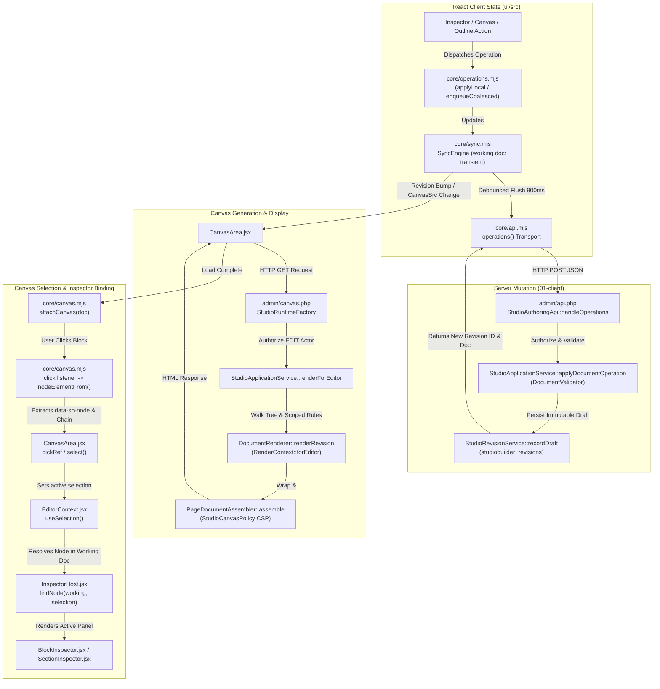
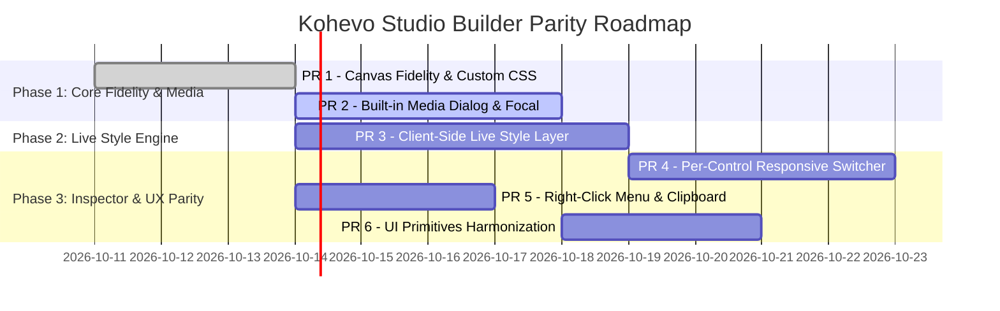

# Kohevo Studio Builder: Industry-Standard Parity Audit & Architectural Blueprint

Date: October 2026  
Status: Authoritative Audit & Architectural Plan  
Target Engine: `01-client/plugins/studio-builder` & `01-client/src/Module/StudioBuilder`

---

## 1. Executive Summary

Kohevo Studio Builder possesses a solid, secure foundation: an immutable revision engine with concurrency conflict detection (`sync.mjs`), a strict canonical document schema (`CanonicalDocumentSchema.php`), 35 core block renderers (`BlockRendererRegistry.php`), a tokenized design system (`ThemeResolver.php`), and an accessible layers tree (`Outline.jsx`). However, it currently falls short of gold-standard interactive parity due to four fundamental friction points: (1) tenant custom CSS and web fonts are withheld in editor mode (`StudioCodePolicy.php:371`), making canvas rendering inaccurate; (2) media selection degrades to a raw integer input when the optional `media-library` plugin is absent (`MediaControl.jsx:18`); (3) property and style updates rely on debounced server iframe reloads rather than instant client-side style injection (`CanvasArea.jsx:111`), causing visual flashing and selection desynchronization; and (4) inspectors lack per-control responsive switches. Adopting **Architecture Option (b)** (Server-rendered canvas + Client-Side Live Style Layer & Built-in Media Dialog) delivers 0ms gold-standard responsiveness and visual fidelity without rewriting the server-side compiler or compromising security.

---

## 2. Part A: Parity Matrix

Scores: **0 = Missing**, **1 = Partial**, **2 = Equal** (evaluated against gold-standard visual builder behavior).

| Area | Score | Verified Evidence (File:Line) | What "Equal" Needs |
| :--- | :---: | :--- | :--- |
| **1. Canvas** | **1** | `StudioCodePolicy.php:371-378` (`customCssMarkup()` returns `''` in Editor); `StudioCodePolicy.php:337-354` (`headMarkup()` skips fonts in editor); `core/canvas.mjs:385` (`auxclick` blocked); `core/canvas.mjs:62-113` (inline text editing works); `CanvasOverlay.jsx:1-120` (floating toolbar). | Inject sanitized site CSS and Google fonts into editor `<head>`; right-click canvas context menu; cross-page clipboard copy/paste; full empty-state section dropzones. |
| **2. Panel / Inspector** | **1** | `InspectorShell.jsx:60-110` (Content/Style/Advanced tabs + search); `SurfaceControls.jsx:100-240` (linked margin/padding, hover states); `controls.jsx:110-140` (`ResponsiveSelect` only on `align`). | Per-control responsive switchers on typography, dimensions, spacing, and layout; universal reset button per control; dynamic token link buttons on all color/length inputs. |
| **3. Navigator / Layers** | **2** | `Outline.jsx:28-66` (`outlineRows` hierarchy); `Outline.jsx:68-87` (drag-reorder); `Outline.jsx:101,400` (inline rename); `Outline.jsx:22,320` (hide/show); `core/layerLock.mjs:1-80` (layer locking); `Outline.jsx:120-138` (search filter). | Full parity achieved. Minor enhancement: bulk expand/collapse toggle. |
| **4. Design System** | **1** | `ThemeResolver.php:40-110` (`DEFAULT_TOKENS` + layers); `TokenPicker.jsx:1-127` (token picker); `ThemeBottomSheet.jsx:1-150` (global theme editor); `StudioCodePolicy.php:371` (custom CSS suppressed in editor). | Expose TokenPicker on all CSS properties (borders, spacing, shadows); per-page and per-block custom CSS; render custom CSS live in editor canvas. |
| **5. Library** | **1** | `LibraryPanel.jsx:1-118` (templates + global components); `SectionPresetsPanel.jsx:1-90` (46 section presets); `PackageDialog.jsx:1-200` (JSON kit import/export). | Interactive responsive template preview modal before insertion; template search and category filtering in main Library panel. |
| **6. Theme Builder** | **1** | `CanonicalDocumentSchema.php:28-36` (`header_partial`, `footer_partial`, `page`, `landing`); `PageDocumentAssembler.php:77-82` (header/footer in context); `CanonicalDocumentSchema.php:68-69` (`conditions`). | Visual display conditions modal (Entire Site, Archives, Specific Singular); dynamic "Preview as [Post / Archive]" data switcher in TopBar. |
| **7. Responsive** | **1** | `core/viewport.mjs:1-40` (Desktop/Tablet/Mobile switcher); `CanvasArea.jsx:365-386` (device stage scaling); `StudioStylesheet.php:393-404` (media queries); `CanonicalDocumentSchema.php:180` (`block.responsive`). | Responsive values across font size, margin, padding, flex direction, and column widths; active device icon indicators in inspector labels. |
| **8. Media** | **0** | `MediaControl.jsx:18-65` (fallback to raw Media ID number box); `MediaControl.jsx:74-80` (bare HTML sliders); `FocalPointControl.jsx:1-97` (orphaned 2D reticle); `CoreMediaResolver.php:30-65` (no `srcset`). | Built-in media modal with upload dropzone and tenant media grid; wire `FocalPointControl` into `MediaControl`; automated `srcset` generation. |
| **9. Widgets / Elements** | **1** | `Render/Block/CoreRenderers/` (35 block renderers including Accordion, Tabs, Carousel, Forms, Query Loop); `ElementManager.jsx:1-120` (element activation and usage tracking). | Add Nav Menu widget with dropdowns, Map widget, and Embed widget; support simulated interaction states (tab switching, accordion collapse) inside editor. |
| **10. Workflow Safety** | **1** | `core/sync.mjs:157-245` (debounced autosave + optimistic apply); `HistoryDialog.jsx:1-80` (revision restore); `ConflictBanner.jsx:1-50` (409 conflict handling); `VisitorPreview.jsx:1-80` (visitor preview). | Schedule publish modal (`publish_at` queue); visual revision diff comparison in History panel. |
| **11. Performance & A11y** | **1** | Fast bundle; `CanonicalDocumentSchema.php:21` (`MAX_BLOCKS = 250`); `Outline.jsx:7-9` (keyboard tree control); `LiveRegion.jsx:1-15` (ARIA announcements); `MobileDock.jsx:1-40` (mobile editing mode). | Eliminate iframe flashing during styling via client-side style layer; raise block limit safely; enhance drag/drop screen-reader feedback. |

---

## 3. Part B: Root-Cause Audit

### B.1 Data-Flow Architecture Map



### B.2 Verification of Known Symptoms

#### Symptom 1: Canvas Does Not Look Like Live Page (Missing CSS/Fonts)
- **Evidence**: `StudioCodePolicy.php:371-378` explicitly checks `if ($mode === RenderMode::Editor) return '';`. Line 337 suppresses `headMarkup()` (`studio_code_head_snippet`) in non-public modes.
- **Expected**: Canvas reflects tenant custom CSS rules and external fonts loaded via head snippets.
- **Actual**: Canvas renders default unstyled HTML; custom typography and tenant styling are stripped.
- **Test Sketch**:
  ```javascript
  test('canvas iframe renders tenant custom css and font links', async ({ page }) => {
    await saveCustomCss(page, '.my-hero { background: rgb(255, 0, 0); }');
    const frame = page.frameLocator('iframe.sbx-canvas__frame');
    await expect(frame.locator('style[data-sb="tenant-css"]')).toHaveText(/rgb\(255, 0, 0\)/);
  });
  ```

#### Symptom 2: Image Blocks Show Raw "Media ID" Box & Focal Sliders
- **Evidence**: `MediaControl.jsx:18` checks `window.SlateMedia?.open`. When absent, lines 55–65 render a plain numeric input `<input type="number">`. Lines 74–80 render two raw range inputs without importing `FocalPointControl.jsx`.
- **Expected**: Clicking an image control opens a visual media picker with uploads, thumbnails, and a 2D interactive focal reticle.
- **Actual**: Users without `media-library` must manually memorize and type numeric database IDs into a text field.
- **Test Sketch**:
  ```javascript
  test('image control opens standalone media dialog and wires focal reticle', async ({ page }) => {
    await page.click('[data-testid="choose-image-btn"]');
    await expect(page.locator('.sbx-media-dialog')).toBeVisible();
    await expect(page.locator('.sbx-focal-point__reticle')).toBeVisible();
  });
  ```

#### Symptom 3: Live Canvas and Editor Drift Apart (Stale Canvas, Dropped Clicks)
- **Evidence**: `canvasLiveSync.mjs:86` marks 7 block types as `SERVER_RENDERED_TYPES`. `canvasLiveSync.mjs:103` treats any non-align style change as structural. `CanvasArea.jsx:125-134` triggers an asynchronous iframe reload debounced at 250ms after server confirmation (900ms debounced save).
- **Expected**: Typing or adjusting sliders instantly updates the canvas without frame destruction.
- **Actual**: Adjusting styles causes a noticeable lag followed by a white flash / reload of the entire iframe document, destroying focus and dropping subsequent click events.
- **Test Sketch**:
  ```javascript
  test('style adjustments update canvas instantly without iframe reload', async ({ page }) => {
    let reloads = 0;
    page.on('framenavigated', () => reloads++);
    await page.fill('[data-testid="margin-top-input"]', '40px');
    await page.waitForTimeout(500);
    expect(reloads).toBe(0);
  });
  ```

#### Symptom 4: UI Inconsistency Across Shell Components
- **Evidence**: `ui/src/components/ui/index.js` exports `Pills`, `Field`, `Tile`, `Check`. However, `SiteSettings.jsx`, `MoreBottomSheet.jsx`, and `ThemeBottomSheet.jsx` render custom HTML inputs with unstandardized styling.
- **Expected**: Uniform padding, typography, label alignment, focus states, and component hierarchy across all builder modals and drawers.
- **Actual**: Mismatched button paddings, disparate toggle switches, and inconsistent input heights.

---

### B.3 Canvas Fidelity Analysis

| Public Asset / Feature | Editor Status | Reason / Security Policy | Risk & Tenant Exploit Potential | Minimum Safe Solution |
| :--- | :---: | :--- | :--- | :--- |
| **Tenant Custom CSS** | **Omitted** | Rule (a) in `StudioCodePolicy.php:33` (Accident/Oversight). | CSS exfiltration via `url()` (blocked by CSP `connect-src 'none'`), `position:fixed` covering UI, `pointer-events:none`. | Emit sanitized custom CSS in Editor `<head>`; append editor overlay guard rule: `[data-sb-node] { pointer-events: auto !important; }`. |
| **Head Snippets & Web Fonts** | **Omitted** | Security Rule (a) (`StudioCodePolicy.php:337`). | Smuggled `<script>` tags inside snippets. | Filter `<head>` snippets for safe `<link rel="stylesheet">` and `@font-face` styles only; emit them in Editor mode while keeping analytics scripts blocked. |
| **Interactive Runtime** | **Omitted** | CSP `script-src 'none'` (`StudioCanvasPolicy.php:28`). | Scripts executing in same-origin iframe could access `window.parent` and steal authoring credentials. | Keep iframe scriptless. Builder parent dispatches synthetic DOM state updates (e.g., toggling `aria-expanded` and `hidden` attributes on click) to simulate tab/accordion states. |
| **GA4 / GTM Analytics** | **Omitted** | Intentional analytics hygiene (`StudioCodePolicy.php:36`). | Editor preview traffic polluting live visitor statistics. | Keep omitted in Editor and Preview modes. |

---

### B.4 Sync Correctness & Race Condition Audit

1. **Document Mutation Paths**:
   - *Inspector edits*: Non-structural edits attempt `syncLiveDOM`; style edits trigger debounced `save_draft` (900ms) -> reload (250ms).
   - *Drag & Drop*: Immediately flushes `ops.insertBlock` / `ops.moveBlock` (0ms debounce) -> replaces document -> reloads iframe.
   - *Undo / Redo / History*: Server `rollback` command replaces `base` and `working` -> reloads iframe.
   - *Template Application*: Server transaction replaces document -> reloads iframe.
2. **DOM ID vs. Document ID Divergence**:
   - *Global Sections*: A section with `global_ref` renders embedded blocks with `__sb_embedded` (`DocumentRenderer.php:290`). Child blocks omit `data-sb-node`. The click chain selects only the outer referencing section.
   - *Query Loops*: Dynamic post items are generated at render time without canonical block IDs. Selection correctly targets the parent `core.query_loop` container.
   - *Provisional IDs*: When inserting blocks before server confirmation, temporary IDs (`tmp_...`) exist in memory. If an integrity check runs before the server confirms, `CanvasArea.jsx:178` triggers an integrity repaint, causing race conditions and losing user selection.

---

### B.5 Media Subsystem Trace & Built-in Specification

#### End-to-End Media Flow
1. **Document Value**: Stored as a pure canonical reference `media_ref = { media_id: int, alt: string, focal_point: [float, float] }`.
2. **Server Validation**: `DocumentValidator.php` verifies `media_id` via `Media::get($id)` scoped to active tenant.
3. **Renderer Resolution**: `CoreMediaResolver.php:30-65` resolves file path to absolute URL and dimensions.
4. **Current Breakage**: Client UI depends on `window.SlateMedia`. If `media-library` is uninstalled or permissions are restricted, the picker fails completely.

#### Built-in Media Specification
- **Server Endpoints**:
  - `GET /plugins/studio-builder/admin/api.php?action=media_list&page=1&search=...`: Returns `{ items: [{ id, url, name, width, height, mime, size }], total }` scoped strictly to `TenantContext::id()`.
  - `POST /plugins/studio-builder/admin/api.php?action=media_upload`: Handles multipart file upload, validates image mime types (`image/jpeg`, `image/png`, `image/webp`, `image/svg+xml`), limits size to 10MB, and registers via core `Media::upload()`.
- **Client UI**:
  - Replace raw input with a unified modal dialog (`MediaDialog.jsx`) featuring an upload dropzone, thumbnail grid, search bar, alt-text field, and the interactive `FocalPointControl.jsx`.

---

## 4. Findings Table

| ID | Area | Severity | Evidence (File:Line) | User Impact | Root Cause | Fix Description | Effort |
| :---: | :--- | :---: | :--- | :--- | :--- | :--- | :---: |
| **F-01** | Canvas | **High** | `StudioCodePolicy.php:371-378` | Canvas looks unstyled; custom CSS and fonts are invisible in editor. | `customCssMarkup()` returns `''` when `$mode === RenderMode::Editor`. | Emit sanitized custom CSS and font links in Editor mode with overlay protection. | **S** |
| **F-02** | Media | **High** | `MediaControl.jsx:18-65` | Users must type raw numbers for image IDs if plugin is absent. | Hard dependency on `window.SlateMedia` from external plugin. | Build native `media_list` & `media_upload` API endpoints and `MediaDialog` modal. | **M** |
| **F-03** | Media | **Medium** | `MediaControl.jsx:74-80` | Clunky, non-visual focal point configuration. | Uses two range sliders instead of orphaned `FocalPointControl.jsx`. | Wire `FocalPointControl` into `MediaControl`. | **S** |
| **F-04** | Canvas / Sync | **High** | `canvasLiveSync.mjs:103`, `CanvasArea.jsx:111` | Laggy slider feedback; iframe flashes/reloads on style edits. | Style changes treated as structural; triggers iframe reload. | Inject a live dynamic `<style id="sbx-live-styles">` tag into canvas `<head>` in 0ms. | **M** |
| **F-05** | Inspector | **Medium** | `controls.jsx:110-140` | Cannot set device-specific margins, paddings, or font sizes. | `ResponsiveSelect` only implemented for `align`. | Add per-control responsive switcher to all spacing, typography, and dimension fields. | **M** |
| **F-06** | Canvas | **Medium** | `core/canvas.mjs:385` | No right-click quick actions on canvas elements. | `auxclick` event is unconditionally blocked on canvas document. | Add canvas right-click context menu (Edit, Duplicate, Copy, Lock, Delete). | **S** |
| **F-07** | Design System | **Medium** | `SurfaceControls.jsx:100-240` | Inconsistent token usage; colors/spacing lack token linkers. | Direct string/hex inputs used instead of `TokenPicker`. | Integrate `TokenPicker` popover trigger into all color and spacing inputs. | **M** |
| **F-08** | UI | **Low** | `SiteSettings.jsx:1-100` | Visual mismatch across modals, drawers, and panels. | Screens bypass shared primitives in `components/ui`. | Refactor drawers and dialogs to use `Field`, `Pills`, `Tile`, `Check`. | **S** |

---

## 5. Architecture Recommendation (Part B.6)

### Comparison of Architectural Approaches

| Criterion | (a) Server Render + Hardened Live Patch | (b) Server Render + Dynamic Live Style Layer (Recommended) | (c) Full Client-Side React Document Rebuild |
| :--- | :--- | :--- | :--- |
| **Effort** | **Medium (M)** (~3 weeks) | **Medium (M)** (~3 weeks) | **Very Large (L/Rebuild)** (~10–12 weeks) |
| **Risk** | **High**: Dual-maintenance of HTML mutation in PHP and JS; frequent drift. | **Low**: 100% PHP SSR fidelity; JS only manages dynamic CSS tag. | **Very High**: Permanent parity divergence between PHP SSR and React canvas. |
| **What It Unlocks** | Incremental fix without core refactoring. | **0ms instantaneous slider feedback**, zero iframe reloads on style edits, perfect SSR parity. | Full component lifecycle in editor; interactive widget execution in canvas. |
| **What It Breaks** | Inherent race conditions on fast typing; brittle DOM class scraping. | Requires client-side CSS generation matching `StyleSurface.php`. | Rewrites 35 block renderers, breaks server security guarantees. |

### Recommendation & Rationale
**Adopt Architecture Option (b)**.
By maintaining the server-rendered HTML iframe for DOM structure while injecting a live `<style id="sbx-live-styles">` tag driven by React state in real time:
1. **0ms Latency**: Color pickers, padding sliders, typography dropdowns, and responsive switches update instantaneously without waiting for network saves or triggering iframe reloads.
2. **Guaranteed SSR Fidelity**: Published output and public SSR continue to be generated by the authoritative PHP compiler (`DocumentRenderer.php`), eliminating "looks different in editor than in production" bugs.
3. **Security Boundary Preserved**: The canvas iframe remains strictly sandboxed with `script-src 'none'`, preventing tenant-supplied code execution.

---

## 6. Implementation Roadmap



### PR 1: Canvas Visual Fidelity & Custom CSS Injection
- **Scope**: Update `StudioCodePolicy.php` to emit sanitized custom CSS and head font links in `RenderMode::Editor`. Add canvas overlay CSS guard rule preventing `pointer-events: none` on authoring nodes.
- **Prerequisites**: None.
- **Acceptance Tests**:
  1. Save global custom CSS `.sb-hero { border: 5px solid red; }`; open canvas in editor; hero renders with red border immediately.
  2. Add Google Font link to head snippet; editor canvas renders headings in declared Google font.

### PR 2: Native Built-in Media Dialog & Focal Point Picker
- **Scope**: Add `media_list` and `media_upload` actions to `admin/api.php`. Create `MediaDialog.jsx` modal with drag-and-drop upload and search grid. Wire `FocalPointControl.jsx` into `MediaControl.jsx`.
- **Prerequisites**: None.
- **Acceptance Tests**:
  1. Disable `media-library` plugin; click "Choose Image"; built-in modal opens with uploaded assets.
  2. Upload image via modal dropzone; asset appears in grid and selects into document.
  3. Drag focal point reticle to (80%, 20%); `object-position: 80% 20%` is saved and reflected in canvas.

### PR 3: Client-Side Live Style Layer (0ms Instant Feedback)
- **Scope**: Implement `core/liveStyleGenerator.mjs` matching `StyleSurface.php`. In `CanvasArea.jsx`, inject and update `<style id="sbx-live-styles">` inside the iframe `<head>` synchronously on every React state change. Suppress iframe reloads for all style mutations.
- **Prerequisites**: PR 1.
- **Acceptance Tests**:
  1. Drag padding slider continuously; canvas updates in 0ms without iframe navigation or white flash.
  2. Change background color token; canvas background changes instantly while typing.

### PR 4: Universal Per-Control Responsive Switcher
- **Scope**: Expand `controls.jsx` to wrap inspector controls with device breakpoint toggles (Desktop, Tablet, Mobile). Store responsive overrides under `block.responsive[device][property]`. Update `StudioStylesheet.php` and `liveStyleGenerator.mjs` to emit responsive media queries.
- **Prerequisites**: PR 3.
- **Acceptance Tests**:
  1. Set font-size to 40px on Desktop, switch to Mobile icon and set to 24px; switching viewport switcher in top bar toggles font sizes correctly.

### PR 5: Canvas Context Menu & Cross-Page Clipboard
- **Scope**: Listen to `contextmenu` in `core/canvas.mjs`; render floating `ContextMenu.jsx` (Edit, Duplicate, Copy to Clipboard, Paste, Lock, Delete). Implement `navigator.clipboard` JSON serialization for cross-page pasting.
- **Prerequisites**: PR 1.
- **Acceptance Tests**:
  1. Right-click section on Page A -> "Copy"; navigate to Page B -> "Paste"; section inserts with fresh IDs.

### PR 6: UI Primitives Harmonization
- **Scope**: Refactor `SiteSettings.jsx`, `ThemeBottomSheet.jsx`, `MoreBottomSheet.jsx`, and `HistoryDialog.jsx` to use standardized primitives from `components/ui/`.
- **Prerequisites**: PR 2.
- **Acceptance Tests**:
  1. All modal inputs and switches match the design system tokens and keyboard focus styling.

---

## 7. Risks and Open Questions

1. **CSS Specificity vs. Canvas UI Overlays**:
   - *Risk*: Tenant custom CSS using `* { pointer-events: none !important; }` or `position: fixed !important` could disrupt element picking.
   - *Mitigation*: The builder parent injects an authoring stylesheet after tenant CSS: `[data-sb-node] { pointer-events: auto !important; cursor: default !important; }`.
2. **Complex Server-Rendered Block Mutations**:
   - *Risk*: Blocks like `core.query_loop` depend on database SQL queries and cannot be styled via simple client CSS rules alone.
   - *Mitigation*: Keep structural updates and dynamic query provider parameter changes debounced through server saves; style properties (spacing, typography, backgrounds) update via PR 3 live style layer.
3. **Open Question on Media Quotas**:
   - *Question*: Should the built-in media upload enforce per-tenant disk storage quotas?
   - *Resolution*: Delegate storage quota enforcement to the existing core `Slate\Services\Media\Media` service during the `media_upload` endpoint validation.
